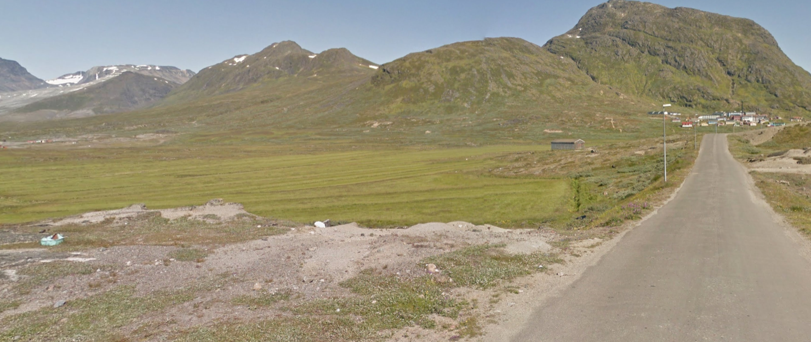
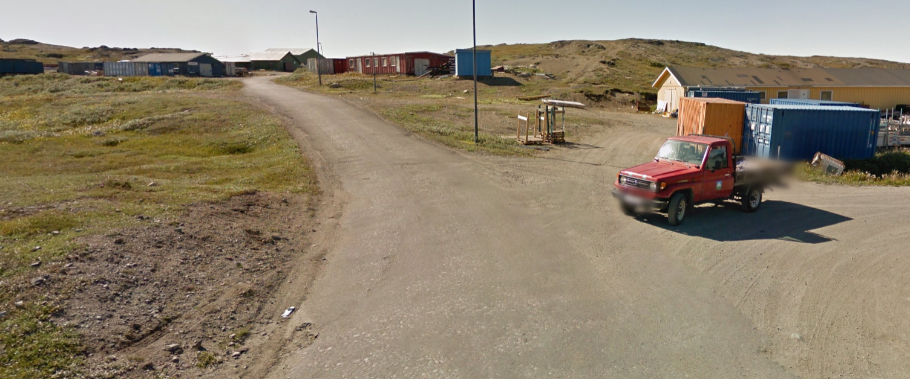
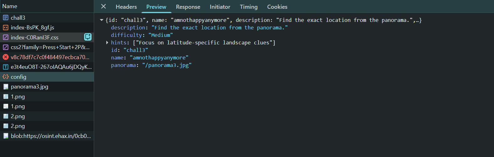

# amnothappyanymore

| Field      | Value |
|------------|-------|
| Category   | OSINT |
| Points     | 50 |
| Solves     | 161 |

## Description

https://osint.ehax.in/

From here choose challenge - `amnothappyanymore`

## Writeup

On initially seeing the challenge, you will see a green mountain ranges with roads and an icy river and peaks.




Also if you inspect network requests, you will find the hint for the challenge - "Look for shoreline and terrain clues"



If we inspect closely the light pole in image_1, we can see it is normally found in Greenland; which has some greenery and icy peaks. Also in relation to the question name. Greenland comes 2nd in World Happiness Index.

On searching Greenland for a while you will find the location - Nuugaarmiunut, Greenland

### Flag

```
EH4X{gr33nl4nd_15nt_gr33n_4nd_1c3l4nd_15nt_wh1t3}
```

## Author

TitanCode
