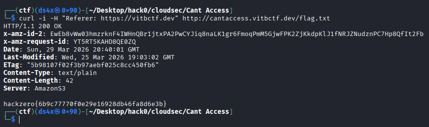

# Cant Access??

| Field      | Value |
|------------|-------|
| Category   | Cloud Security |
| Points     | 150 |
| Solves     | 72 |

## Description

No reference, no access.
Or is any reference enough?

Flag Format:
`hackzero{}`

**Challenge URL**: http://cantaccess.vitbctf.dev

## Writeup

> ```Flag:```  `hackzero{6b9c77770f0e29e16928db46fa8d6e3b}`


## Challenge Info
-Name: Cant Access??
- Points: 150
- Author handle shown: @pphreak_1001
- Hint: “No reference, no access. Or is any reference enough?”
- Target URL: http://cantaccess.vitbctf.dev
- Flag format: hackzero{...}
- **Solved By:** ret2.libc

- curl i.e., command line HTTP client, which means I can send custom request headers.
Possible substitute tools:

- httpie (http) i.e., friendlier HTTP CLI.
- Burp Suite 
- wget 

## Step 1: Check base URL response
I first checked what the server gives on /.

```bash
curl -i http://cantaccess.vitbctf.dev/
```


I got:

HTTP/1.1 403 Forbidden
Server looked like Amazon S3 i.e., object storage bucket service.
Which means direct access is blocked by policy.

## Step 2: Read hint carefully
Hint says: No reference, no access.
I interpreted “reference” as HTTP Referer header (commonly spelled Referer in HTTP).

HTTP i.e., HyperText Transfer Protocol, which means browser/server message format.
Header i.e., metadata in request/response.
Referer i.e., source page URL sent by client.
So I tested requests with custom Referer.

## Step 3: Try Referer bypass
I tested likely allowed referers and likely file paths.

Quick one-shot test:

```bash
curl -i -H "Referer: https://vitbctf.dev" http://cantaccess.vitbctf.dev/flag.txt
```




This returned 200 OK and revealed the flag.
Bucket policy likely checks exact Referer match.
So “any reference” is not enough.
Correct/specific reference was needed.


## Final Flag
hackzero{6b9c77770f0e29e16928db46fa8d6e3b}

## Author

ret2.libc
