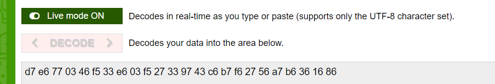

# Back to the Basics

| Field      | Value |
|------------|-------|
| Category   | Cryptography |
| Points     | 25 |
| Solves     | 175 |

## Description

How can we have a CTF without a challenge that provides no context what-so-ever?
Well, someone once said "Sometimes we forget to approach a problem in reverse".

```
ciphertext = "ZDcgZTYgNzcgMDMgNDYgZjUgMzMgZTYgMDMgZjUgMjcgMzMgOTcgNDMgYzYgYjcgZjYgMjcgNTYgYTcgYjYgMzYgMTYgODY="
```

## Writeup

> ```Flag:```  `hackzero{l4y3r_0n3_d0wn}`

---

## Challenge Information
- **CTF Name:** HackZero 2026
- **Challenge Name:** Back to the Basics
- **Category:** Crypto
- **Points:** 25
- **Author:** @AnkitS01
- **Solved By:** ret2.libc

---

## Description
> Given Ciphertext
> ZDcgZTYgNzcgMDMgNDYgZjUgMzMgZTYgMDMgZjUgMjcgMzMgOTcgNDMgYzYgYjcgZjYgMjcgNTYgYTcgYjYgMzYgMTYgODY=
> 
> Hint: “Sometimes we forget to approach a problem in reverse.”

---

## Observations
I found out this is a base64 formmat by seening the ciphertext itself.

---

## Initial Analysis
Describe your first observations.

Base64-like ciphertext with spaced hex output after decoding
- Interesting hints: “Sometimes we forget to approach a problem in reverse.”
- Tools used:
  - Decodefr

---

## Enumeration / Recon

### 🔎 Step 1: Basic Recon
```bash
echo 'ZDcgZTYgNzcgMDMgNDYgZjUgMzMgZTYgMDMgZjUgMjcgMzMgOTcgNDMgYzYgYjcgZjYgMjcgNTYgYTcgYjYgMzYgMTYgODY=' | base64 --decode
```

---

## Exploitation / Solving Steps

### Step 1: Entry Point
The ciphertext was clearly Base64-encoded text that decoded to space-separated hex byte values.

---

### Step 2: Exploitation
Show payloads / method used:

```bash
echo 'ZDcgZTYgNzcgMDMgNDYgZjUgMzMgZTYgMDMgZjUgMjcgMzMgOTcgNDMgYzYgYjcgZjYgMjcgNTYgYTcgYjYgMzYgMTYgODY=' | base64 --decode
# output: d7 e6 77 03 46 f5 33 e6 03 f5 27 33 97 43 c6 b7 f6 27 56 a7 b6 36 16 86

# reverse each nibble in each byte:
# d7 -> 7d, e6 -> 6e, 77 -> 77, 03 -> 30, ...
# intermediate string: }nw0d_3n0_r3y4l{orezkcah
# reverse the full string:
# hackzero{l4y3r_0n3_d0wn}
```


---

## Tools Used

- decodefr
- base64decode

---

## Screenshots



---

## Author

ret2.libc
