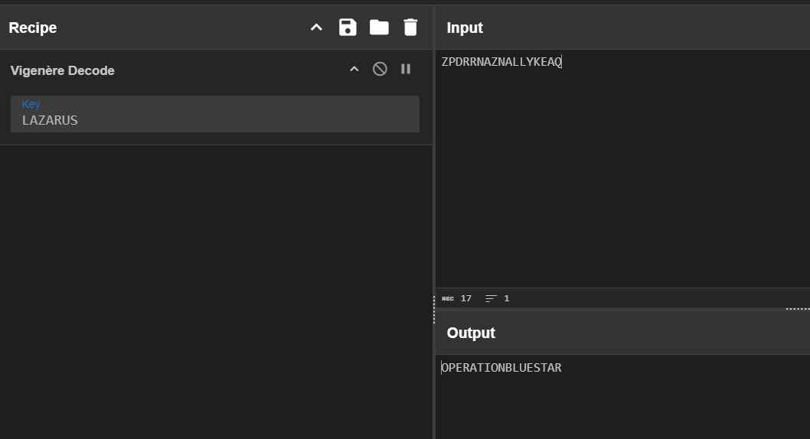

# Dead Signal

| Field      | Value |
|------------|-------|
| Category   | Cryptography |
| Points     | 50 |
| Solves     | 138 |

## Description

Our threat intel team intercepted beacon traffic from a suspected LAZARUS Group C2 node. Along with the traffic, they recovered an internal bulletin and two encrypted payloads. No key material was found on the server but the analysts have a hunch it never left the bulletin to begin with. Crack the first payload to find the codename. Use the codename to crack the second. LAZARUS always reuses what works.

Flag Format:
`hackzero{}`

## Files

- [Dead_Signal.rar](./Dead_Signal.rar)

## Writeup

> ```Flag:```  `hackzero{l4z4rus_v1g_x0r_bl13st4r}`

## Challenge Information
- **CTF Name:** HackZero 2026
- **Challenge Name:** Dead Signal
- **Category:** Cryptography
- **Points:** 250
- **Author:** -
- **Solved By:** ret2.libc


I got this challenge with one archive: `Dead_Signal.rar`, and the chall description was basically telling me that

- there are 2 encrypted payloads
- first one gives codename
- codename helps crack second one
- LAZARUS reuses methods, i.e. same style might be used again
- Flag format was `hackzero{...}`

I really liked this one, btw. Clean hinting, not too random, and good learning flow. 

## 1) Extraction

I extracted the archive first. Inside I got 3 files:

- `intercepted.txt`
- `lore.txt`
- `deadrop.hex`

I used `winrar` to extract;

Then I opened the files:

- `intercepted.txt` had: `ZPDRRNAZNALLYKEAQ`
- `deadrop.hex` had hex string:
  `273126393b313b20352e782f712121320d3961220d39643b102c2e7d66362760332f`
- `lore.txt` was bulletin text, which means likely clue is hidden in writing itself.

## 2) Hidden key in bulletin

I read `lore.txt` carefully and checked first letters of the important lines (acrostic style), i.e. taking first character line by line.

It gave me:

`L A Z A R U S` -> `LAZARUS`

So I used `LAZARUS` as key for stage 1.

## 3) Stage 1 decryption

Ciphertext was:

`ZPDRRNAZNALLYKEAQ`

Using Vigenere decrypt with key `LAZARUS`, I got:

`OPERATIONBLUESTAR`

So codename is `BLUESTAR` (full recovered string is `OPERATIONBLUESTAR`). This matches the chall description exactly, which means stage 1 solved.

## 4) Stage 2 crack

`deadrop.hex` is hex text, i.e. bytes written in base-16 form.

So I,
- converted hex -> raw bytes
- tried repeating-key XOR using recovered codename string context

The key that cleanly worked was:

`OPERATIONBLUESTAR`

Decrypted plaintext became:

`hackzero{l4z4rus_v1g_x0r_bl13st4r}`

That is valid flag format, so done.

## Final Flag

`hackzero{l4z4rus_v1g_x0r_bl13st4r}`




## Author

ret2.libc
