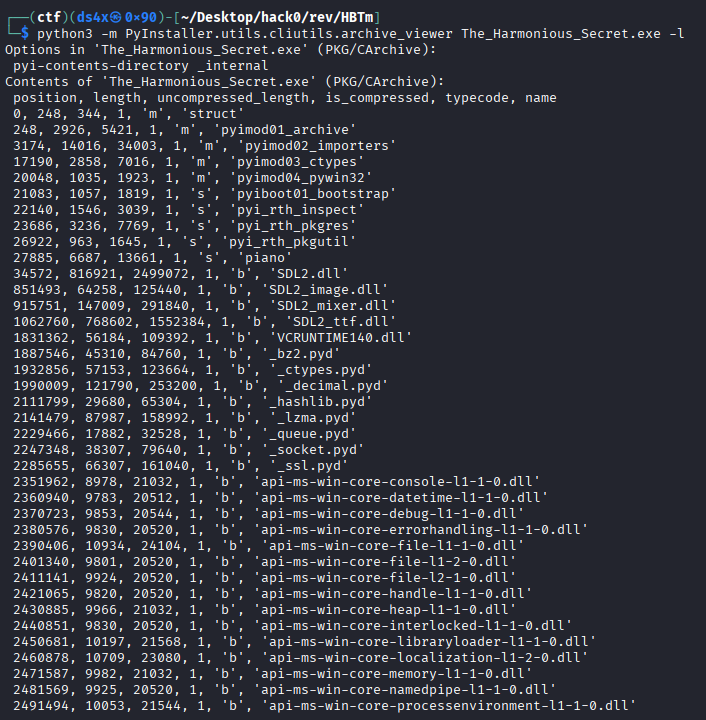
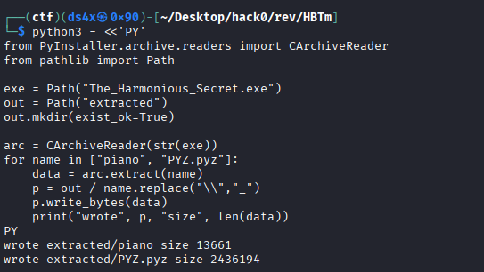
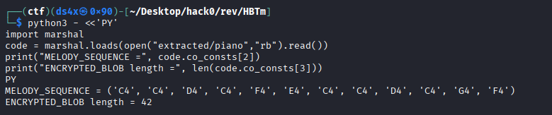

# Happy Birthday To me!

| Field      | Value |
|------------|-------|
| Category   | Reversing |
| Points     | 150 |
| Solves     | 94 |

## Description

A silent piano waits.

It does not care for noise — only precision.
Keys must be struck in the right memory of melody.

What seems like music is merely input.
What seems like sound is just bytes being judged.

Play it wrong, and nothing happens.
Play it right… and it remembers.

Somewhere in its logic, a familiar tune unlocks everything.

Do you hear it, or will you reverse it? 🎹

## Files

- [The_Harmonious_Secret.exe](./The_Harmonious_Secret.exe)

## Writeup

> ```Flag:```  `hackzero{76129c1ad37ba42f4e3ae1c662abd639}`

## Challenge Information
- **CTF Name:** HackZero 2026
- **Challenge Name:** Happy Birthday To me!
- **Category:** Reversing
- **Points:** 150
- **Author:** @pphreak_1001
- **Solved By:** ret2.libc


 The story hint was very clean: piano, melody, precision, memory, bytes. That hint was actually the full road map.

## 1. Challenge understanding
I read the chall description and took these hints seriously:

- “silent piano”
- “keys must be struck in right memory of melody”
- “music is input”
- “sound is bytes being judged”
- “familiar tune unlocks everything”

So I guessed this is a RE challenge, i.e., RE which mean Reverse Engineering, and we need correct key sequence, not random brute force.

## 2. First triage in Kali


What I got from this and did few more recons, I cam eto know that, 

- It is a Windows PE file, i.e., PE which mean Portable Executable.
- It had clear Python/PyInstaller signs (pyi, pygame, etc.).
- So this is likely a packaged Python app, not a native C binary crackme.


## 3. Tools I used (and substitutes)
I used:

- file
- strings
- python3
- PyInstaller archive viewer (pyi-archive_viewer via pyinstaller package)
- Python marshal + dis modules for bytecode reading


## 4. Listing bundled files inside EXE
```bash
python3 -m PyInstaller.utils.cliutils.archive_viewer The_Harmonious_Secret.exe -l
```


Important find:

- Entry named piano (script payload)
- Entry named PYZ.pyz (python module archive)

This was the jackpot.

## 5. Extracting the piano payload
I extracted using Python:

```bash
python3 - <<'PY'
from PyInstaller.archive.readers import CArchiveReader
from pathlib import Path

exe = Path("The_Harmonious_Secret.exe")
out = Path("extracted")
out.mkdir(exist_ok=True)

arc = CArchiveReader(str(exe))
for name in ["piano", "PYZ.pyz"]:
    data = arc.extract(name)
    p = out / name.replace("\\","_")
    p.write_bytes(data)
    print("wrote", p, "size", len(data))
PY
```


## 6. Reading bytecode constants and logic
Now I loaded extracted/piano as marshaled code object:

```bash
python3 - <<'PY'
import marshal
code = marshal.loads(open("extracted/piano","rb").read())
print("MELODY_SEQUENCE =", code.co_consts[2])
print("ENCRYPTED_BLOB length =", len(code.co_consts[3]))
PY
```



This gave:

- Melody tuple: `('C4','C4','D4','C4','F4','E4','C4','C4','D4','C4','G4','F4')`
- Encrypted byte blob

Then I checked check function disassembly:

```bash
python3 - <<'PY'
import marshal, dis
code = marshal.loads(open("extracted/piano","rb").read())
for c in code.co_consts:
    if isinstance(c, type(code)) and c.co_name == "check_melody":
        dis.dis(c)
PY
```

From bytecode flow I got core logic:

- compare user sequence to hardcoded melody
- join melody with commas
- sha256 digest of that string
- XOR digest bytes with encrypted blob
- output final flag text

So yes, input is “music notes”, but backend is byte crypto check. Very nice author touch.

## 7. Recovering final flag directly
I reproduced the decryption:

```bash
python3 - <<'PY'
import marshal, hashlib
code = marshal.loads(open("extracted/piano","rb").read())

MELODY_SEQUENCE = code.co_consts[2]
ENCRYPTED_BLOB = code.co_consts[3]

melody_str = ",".join(MELODY_SEQUENCE)
key = hashlib.sha256(melody_str.encode()).digest()

flag = "".join(chr(ENCRYPTED_BLOB[i] ^ key[i % len(key)]) for i in range(len(ENCRYPTED_BLOB)))

print("melody_str:", melody_str)
print("flag:", flag)
PY
```


## 8. Output:


- Correct melody input: `C4,C4,D4,C4,F4,E4,C4,C4,D4,C4,G4,F4`
- Flag: `hackzero{76129c1ad37ba42f4e3ae1c662abd639}`

## 9. Short learning points


- marshal constants can leak secrets directly.
- Bytecode disassembly is enough, full native reversing not always needed.

## Author

ret2.libc
