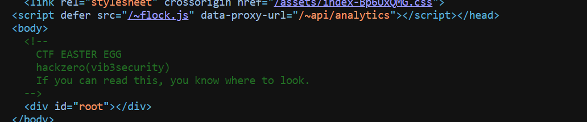

# Vibsecurity Sponsored Challenge

| Field      | Value |
|------------|-------|
| Category   | Sponsors |
| Points     | 50 |
| Solves     | 50 |

## Description

Thank you vibsecurity for being our wonderful sponsor.
Explore about them and you will find the flag at the right place.


Flag format: hackzero()

## Writeup

> ```Flag:```  `hackzero(vib3security)`

## Challenge Information
- **CTF Name:** HackZero 2026
- **Challenge Name:** Vibesecurity Sponsered Challenge
- **Category:** Sponsership Challs: Web Catg.
- **Points:** 150
- **Author:** @Vibsecurity
- **Solved By:** ret2.libc


## Category
OSINT / Web Recon

## Recon Approach
- I Opened the sponsor website in a browser.
- Inspected visible page content.
- View the page source (Ctrl+U) to search for hidden clues.

## Findings
- The homepage source contained a hidden HTML comment indicating an easter egg:

  ```html
  <!--
    CTF EASTER EGG
    hackzero(vib3security)
    If you can read this, you know where to look.
  -->
  ```


## Author

ret2.libc
